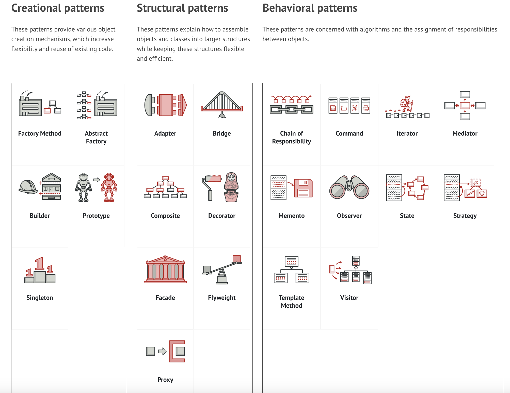

Design Patterns showcase
===

## Resources

Essentials:

- https://en.wikipedia.org/wiki/Design_Patterns
- https://www.gofpattern.com/index.php
- https://www.javier8a.com/itc/bd1/articulo.pdf
- https://www.digitalocean.com/community/tutorials/gangs-of-four-gof-design-patterns

Other:

- https://www.patterns.dev/ contains vanilla JavaScript patterns, React patterns and VueJS patterns.
- https://addyosmani.com/learning-jsdp/ => https://github.com/addyosmani/learning-jsdp
- https://github.com/addyosmani/essential-js-design-patterns - older version
- https://refactoring.guru/design-patterns
- https://www.linkedin.com/posts/brijpandeyji_design-patterns-are-time-tested-templates-activity-7141388959699410945-V9vN

## Key notes about Design patterns

### Creational patterns

**Singleton**:

- The Singleton pattern solves two problems at the same time, violating the (SOLID) Single Responsibility Principle.
- The `Object.freeze()` method makes sure that consuming code cannot modify the Singleton. 
- are actually considered an anti-pattern, and can (or.. should) be avoided in JavaScript.
- Simple real case scenario example is [here](https://codesandbox.io/p/sandbox/singleton-1-64mr1) with two buttons using same Counter object.
- A Facade class can often be transformed into a Singleton since a single facade object is sufficient in most cases.
- Flyweight would resemble Singleton if you somehow managed to reduce all shared states of the objects to just one flyweight object.

### Structural patterns

TBD

### Behavioral patterns

TBD

## Visualization

From https://refactoring.guru/design-patterns/catalog

From LinkedIn:

